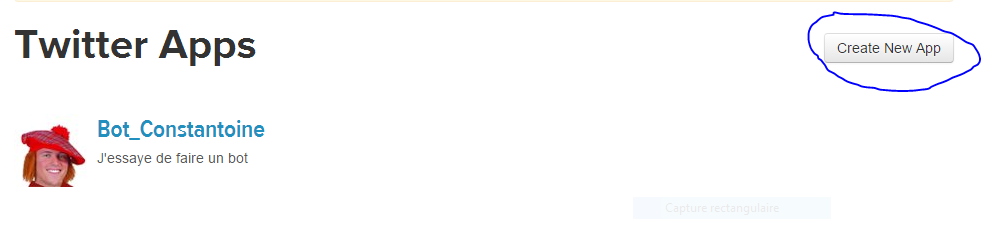
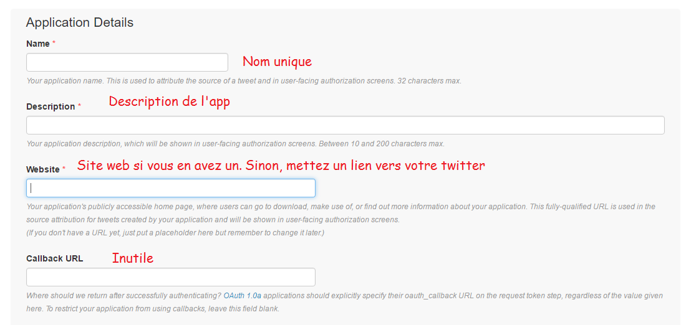
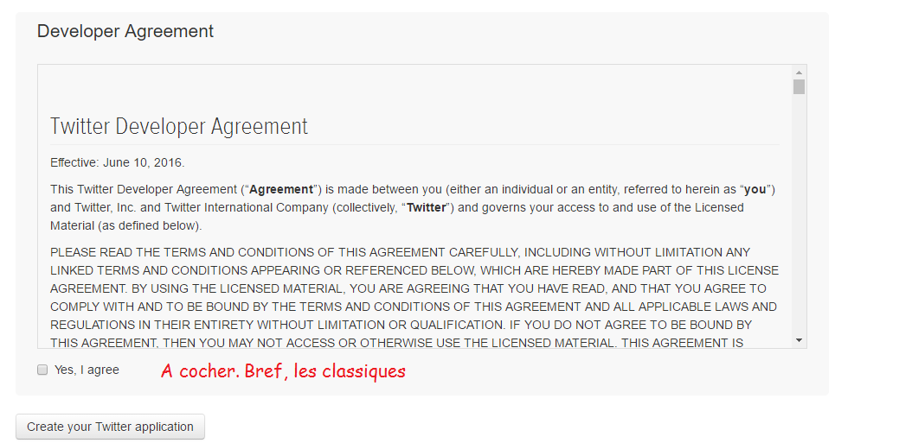
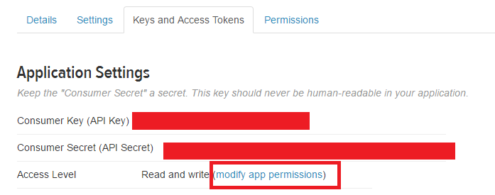
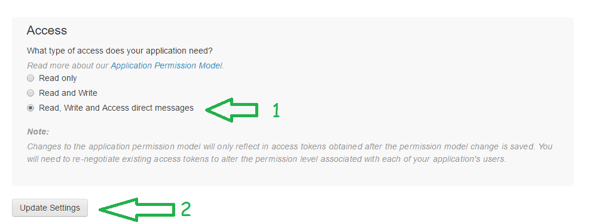
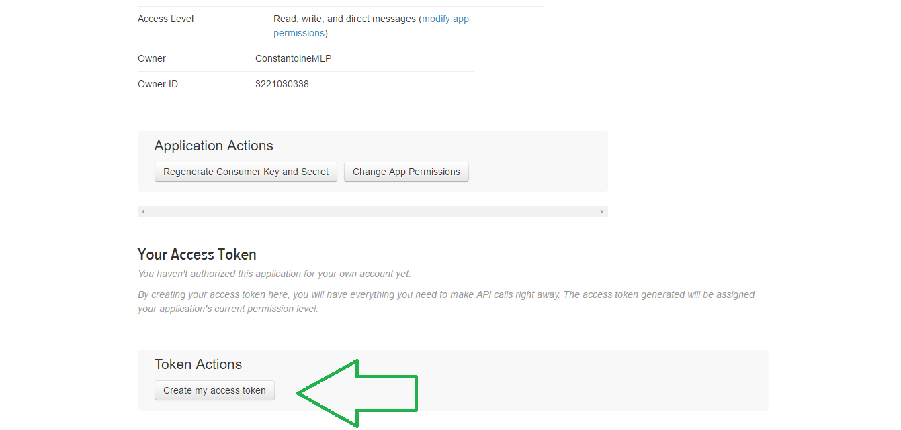
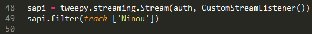
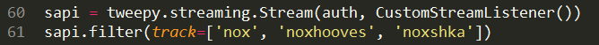

<h1>
	La poubelle de Constantoine
</h1>
<h2>
	Installation
</h2>

	Les scripts sont faits pour fonctionner sous windows, avec python 3.5    

	Pour commencer, <a href="https://www.python.org/ftp/python/3.5.1/python-3.5.1-amd64.exe">vous pouvez installer python 3.5 ici</a> si vous ne le possédez pas déjà. Bon, pour installer un programme, je vous fais confiance. Je vous retrouve pour la suite    

	Une fois python installé sur votre windows, vous allez devoir installer tweepy, une extension qui permet de faire des trucs avec twitter. Pour se faire, ouvrez une invite de commande en mode administrateur. (En gros, taper "cmd" dans la barre de recherche du menu démarrer, faites un clic droit sur "invite de commande" et cliquer sur "exécuter en tant qu'administrateur")    

	Ensuite, tapez "pip install tweepy" (sans les guillemets) et appuyez sur enter    

	Une fois l'installation terminée, vous pouvez lancer les scripts. Voilà. Je vous conseille de télécharger tout le dépot de la poubelle, et de tout mettre dans un dossier vide, histoire d'éviter des conflits en cas d'utilisation de fichiers de configuration    

	Sauf que voilà, c'est pas fini. Pour pouvoir utiliser les scripts, il va falloir remplir des "credentials". Vous pouvez regarder si vous voulez, aucun bout de code ne me permet de les récupérer. Pour avoir ces credentials, vous allez avoir besoin de faire une application twitter.    

	Pour pouvoir en faire une, il faut que votre compte soir vérifié (= vous devez avoir associé un numéro de portable)    

	<a href="https://apps.twitter.com/">Rendez vous donc à cette adresse</a>    

	    

	    

	    

	<h3>
		Ensuite, allez dans "keys and access tokens" et cliquez sur "change app permissions"
	</h3>

	    

	

	<h3>
		Maintenant retournez dans "keys and access tokens" et générez votre token
	</h3>
	
	

		Ne donnez aucun des quatre codes à quique ce soit. En effet, ces codes permettent à votre application ici de lire vos MPs et de tweeter à votre place. Voilà pourquoi vous devez être les seuls à les connaître. Je vous rappelle ici que vous pouvez utiliser la même applications pour plusieurs programmes en python, mais que pour éviter d'avoir des problèmes avec l'API, qui limite le nombre de requêtes sur 15 minutes, si jamais vous voulez faire tourner plusieurs programmes simultanément, peut-être vaut-il mieux d'avoir une application pour chaque programme. Maintenant dans le programme que vous voulez utiliser, copiez vos codes. Pour ce faire, clic droit > Ouvrir avec > bloc-note (Ou un autre éditeur de texte, mais surtout ne l'ouvrez pas comme ça, sinon vous allez le lancer) Et remplacez les "xoxoxoxoxo" par les codes à droite sur les lignes correspondantes
	

	
	

		Et voilà ! C'est terminé, vous êtes prêts à utiliser les programmes ! o/
	

<h2>
	Une idée ? Une demande de programme ? Un bug ? Une suggestion ?
</h2>

	Vous pouvez m'envoyer un <a href="https://twitter.com/ConstantoineMLP">message privé sur twitter</a>, mes DMs sont ouverts. N'hésitez pas ^^

<h2>
	Ninou.py
</h2>
<h3>
	Pourquoi ?
</h3>

	Ce cher connard de Zeke voulait pouvoir autoblock toute personne tweetant "Ninou". Suffisait de demander

<h3>
	Quoi ?
</h3>

	C'est un script qui bloque toute personne utilisant un mot

<h3>
	Comment l'utiliser ?
</h3>

	Une fois les codes renseignés comme décrit dans le chapitre "installation", la seule chose que vous avez à faire, c'est personnaliser les filtres. Vous pouvez soit rechercher un seul mot, soit rechercher les tweets qui contiennent au moins un des mots de la liste :    

	    

	

<h3>
	Que dire de plus ?
</h3>

	Vous pouvez vous amuser à ne pas bloquer vos followers et/ou vos followings. Si vous n'y arrivez pas, je veux bien vous venir en aide, bien entendu ^^

<h2>
	Filter.py
</h2>
<h3>
	Pourquoi ?
</h3>

	Nox avait évoqué que le fait que le terme "Nox" était souvent utiliser, c'était compliqué de rechercher ses indirects. Alors voilà

<h3>
	Quoi ?
</h3>

	Ce script affiche les tweets contenant un ou plusieurs termes (Même procédure pour choisir lesdits termes que sur Ninou.py) qui sont tweetés par les followers. Ainsi, une personne lambda tweetant tel ou tel mot ne sera pas concernée par le programme

<h3>
	Comment l'utiliser ?
</h3>

	Tout pareil que Ninou.py pour la recherche des termes. Pour le reste, le programme s'en charge

<h3>
	Que dire de plus ?
</h3>

	Et bien, même si j'ai eu la flemme de le faire, vous pouvez aussi y inclure vos followings, voire n'y inclure que vos followings

